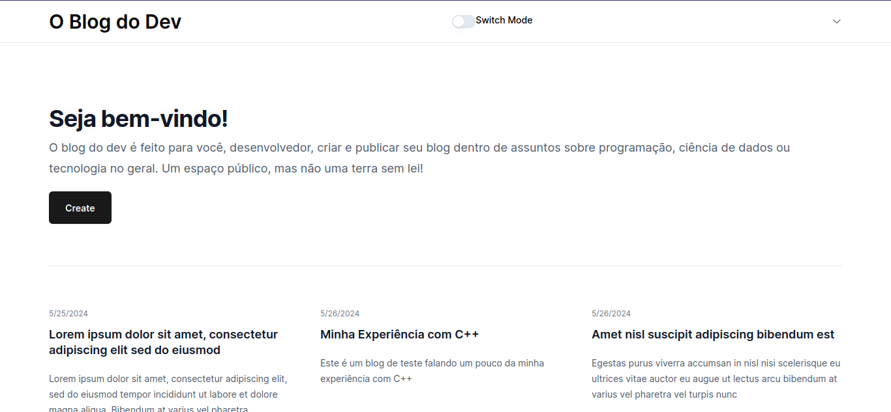
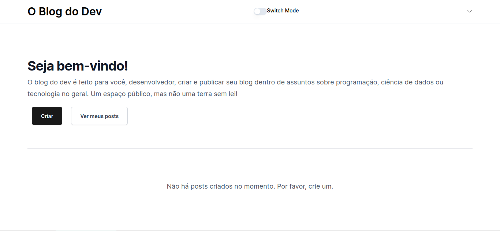
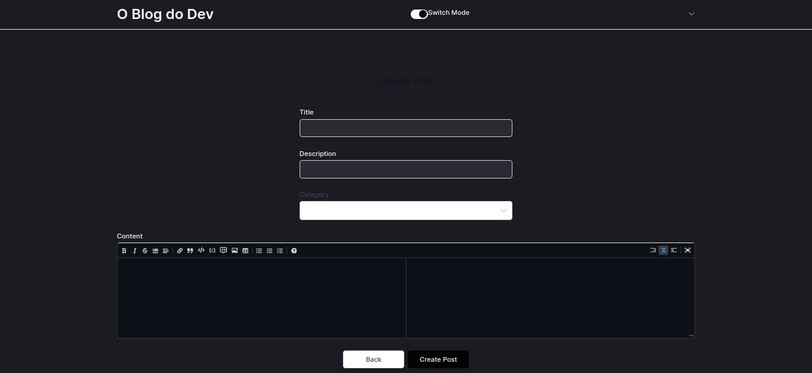

# DevBlog Project
This project is intended to be a complete blog with authentication, editors, good UX and dashboard for admins. It's not ready yet, but it will be soon.

# Tech Stack
- Frontend
    - NextJS
    - TailwindCSS
    - Shadcn UI
    - Yup
    - Markdown
    - Axios
    - Headless UI
    - Heroicons
    - next-auth
    - usehooks-ts
- Backend
    - Phoenix
    - Pow
    - Ecto (with PostgreSQL)
    - cors_plug

# Some screenshots

